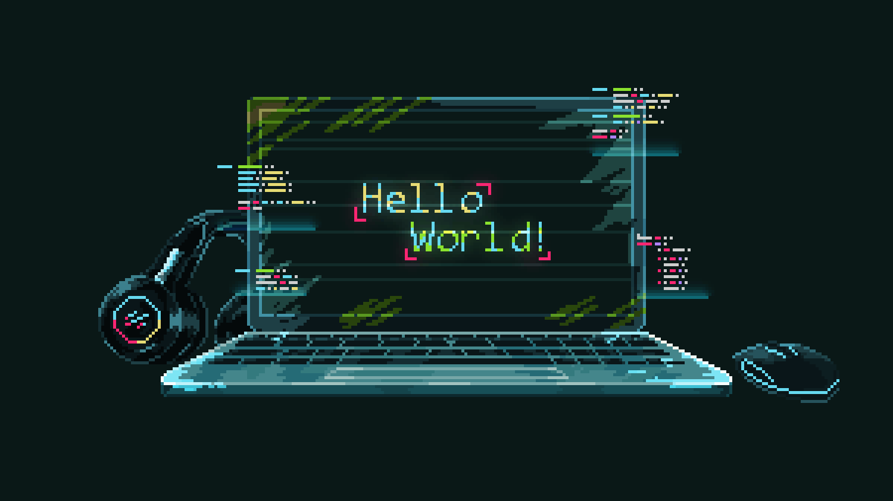

  

## Sobre mim
Olá, meu nome é Leonardo Vitor, sou um profissional apaixonado pela programação, atraído pela capacidade da tecnologia de transformar ideias em realidade. Essa fascinante possibilidade me motivou a seguir a carreira de programador, onde posso aplicar minha criatividade e habilidades técnicas para criar soluções inovadoras. Estou em busca da minha primeira oportunidade nas áreas de Desenvolvimento Web ou Programação.

## Conecte-se Comigo!

  
  

## Stack de Tecnologias

  
  
  
  
  
  
  
  
  
  
  

## Meu Status do Github

  
  

  

## Estante de Troféus

  

